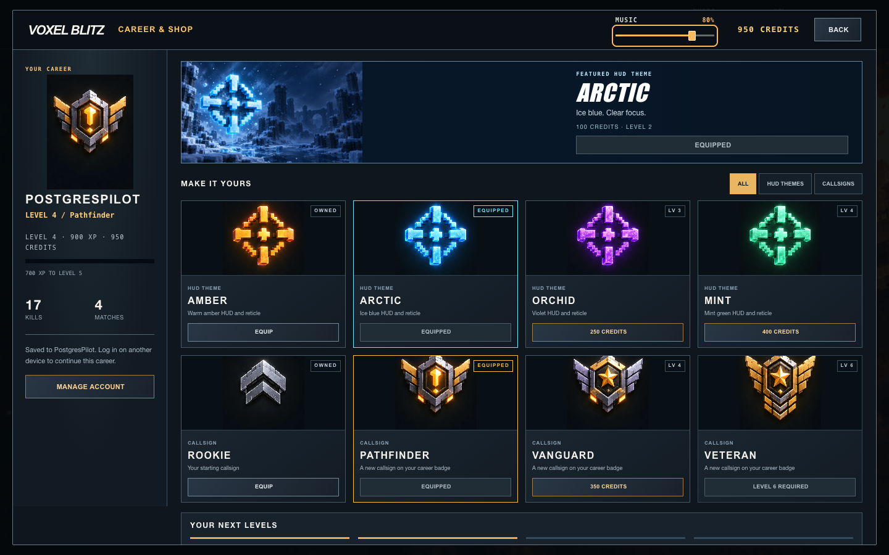

<div align="center">

# VOXEL BLITZ

Fast rounds. Destructible arenas. Straight into your browser.

[](https://github.com/LoggeL/voxel-blitz/actions/workflows/ci.yml)


[Get started](#get-started) · [Screenshots](#screenshots) · [Controls](#controls) · [Developer guide](docs/development.md)

</div>


A multiplayer voxel arena shooter with destructible cover, twelve weapons and bots that keep the action moving. Jump into Quick Play, invite friends to a custom lobby, or work on your aim in the Killhouse.

## Inside the arena

Combat attacks deal 20% less damage than the original balance. A close rifle body hit deals 20 damage, so an unarmored player survives four hits and dies on the fifth. Armor, headshots, range falloff and weapon handling still apply.

- **Break through cover.** Block destruction changes the arena as you fight.
- **Risk a supply run.** Armor, Medkits and Ammo appear on exposed ground in Fun, Team Deathmatch and Chaos Lab. Walk over one to collect it.
- **Find your weapon.** Rifles, a shotgun, a revolver, a sniper, an LMG, a minigun, a flamethrower, rockets, melee, ricocheting LONGARC bolts and the piercing VOLTLANCE. Add cookable frags, sticky charges and pulse shocks.
- **Play with friends or bots.** Up to 32 players per room, with 16 per team, lobby discovery, invite links, QR codes and optional lobby passwords.
- **Feel every shot.** Procedural weapon models, recoil, aiming down sights, staged reloads, tracers, hit feedback and layered audio.
- **Play on desktop or touch.** Mouse and keyboard controls, a radial weapon wheel and mobile touch controls.

| Mode | What you play |
| --- | --- |
| Fun | Free-for-all with the full arsenal and fast respawns. Quick Play drops you into a live room. |
| Chaos Lab | Kills and hidden $300 cash bundles earn credits for 51 cumulative upgrades across all twelve weapons and five throwables. Open the lab with B; upgrades survive death. |
| Team Deathmatch | Two teams race to 40 kills. |
| Search and Destroy | Plant or defuse the bomb, buy your loadout and make each life count. |
| Gun Game | Every kill advances your weapon. Finish the ladder to win. |
| Bastion | Cooperative defense for 1–4 players on Reactor 9: eight waves, three enemy roles, a shared bank and reactor repairs. |
| Training | Respawning range targets and a timed four-stage Killhouse course. |

## Screenshots

Actual browser captures from the game. Arena shots use the built-in fixed-camera capture view, without the gameplay HUD.

| Solstice | Caldera |
| --- | --- |
|  |  |
| Solar observatory, biodome and turbine hall. | Obsidian Gate and Ember Refinery. |


The Killhouse firing line. Practice here, then head into the timed course.

Eleven maps ship with the game: Foundry, Depot, Citadel, Solstice, Caldera, Nuketown, Dust 2, Harbor, Canyon, Killhouse and Reactor 9. Harbor and Canyon cover 192 × 144 blocks, 2.25 times the area of the original arenas, with 16 spawn anchors per team and two S&D sites. [Bastion](docs/pve-bastion.md) uses Reactor 9 exclusively. Create a custom Bastion lobby, ready up and start; B opens supplies and E repairs the core between waves. [Dust 2](docs/maps/dust2.md) brings Long A, Short/Catwalk, Mid Doors and B Tunnels to the destructible voxel world. Select it in a custom lobby for Fun, Chaos Lab, Team Deathmatch, Search and Destroy or Gun Game. See the [map compatibility table](docs/development.md#map-compatibility) for supported modes.

## Get started

You need **Node.js 20+** and npm.

```bash
git clone https://github.com/LoggeL/voxel-blitz.git
cd voxel-blitz
npm ci
npm start
```

Open [localhost:8070](http://localhost:8070), enter a name and choose **Quick Play**. A fresh quick room starts with at least five bots, so you can play on your own immediately.

For persistent hosting, use the [PostgreSQL container stack](docs/development.md#container-deployment): copy `.env.example` to `.env`, set its database password, then run `docker compose up -d --build`. Plain `npm start` without database configuration keeps the local JSON store.

For a match with friends, choose **Create Lobby**, share the invite link or QR code, then have everyone ready up. The host starts the match. Remote players need access to the same running server.

In Team Deathmatch and Search and Destroy, the lobby host assigns humans and bots to Alpha or Bravo before starting. Asymmetric matches such as 2 vs 6 are supported, with a maximum of 16 per team. Assignments survive map changes and match launch; changing a team resets everyone's ready status. Humans joining a full live room replace a bot on its existing team.

To use a different port:

```bash
PORT=8080 npm start
```

## Career and shop

Open **Career & Shop** in the main menu to see your level, XP and career credits. Kills, objectives, active play and completed matches earn rewards. Buy and equip reticle themes and callsigns; these cosmetics do not change combat stats. Training grants no career rewards.

You can play immediately as a guest. Use **Create Account** in the main menu or **Save your career** in the shop to create an optional account. Registration transfers this browser's guest XP, credits and cosmetics to the new account once. **Log in** on another device loads that account's career; it does not merge that device's guest progress.

Accounts use a username and a password with 12 to 128 characters. Save the private recovery code shown after registration: it lets you reset a forgotten password and is replaced after use. Account settings also let you change your password or log out. Your account username becomes your player name.

Guest progress stays linked to this browser through a cookie, so clearing cookies loses access to it. Account progress survives cookie clearing and is available after logging in again on the same game server. The recommended container stack stores accounts and careers in PostgreSQL; retain and back up its database volume. Existing JSON deployments keep their `/app/data` volume until they complete the [documented migration](docs/development.md#import-existing-json-data).



The shop groups HUD themes and callsigns into illustrated cards with level requirements, prices and equipped states. This browser capture uses a test profile after registration, purchases and a PostgreSQL restart.

The **Music** slider is available in the main menu, lobby, lobby browser, account, career and settings screens. Its 0–100% setting stays synchronized between screens and is saved in this browser, independently of game effects volume.

## Controls

These are the default keys. **Settings → Keyboard** lets you rebind 35 actions, clear a binding or restore defaults. Changes are saved in this browser, and the HUD shows the current bindings. Escape remains available for menus.

| Input | Action |
| --- | --- |
| `WASD` / mouse | Move / look |
| `Shift` / `Space` / `Ctrl` or `C` | Sprint / jump / crouch |
| `Space` again in midair | Grab a reachable ledge and pull up, even after releasing movement keys |
| Left / right mouse | Fire / aim down sights |
| `R` | Reload |
| `V` | Quick pickaxe hit for melee or block mining; returns to your weapon |
| `J` | Use or cancel your medkit: stand still for four seconds to fully heal. One per life, consumed only on completion. Movement, damage and combat actions interrupt it. |
| `1–9`, `0` or scroll wheel | Switch weapons |
| Hold `Q`; hover a weapon and release, or move past the outer ring | Weapon wheel |
| Hold and release `G` / press `H` | Throw / change throwable |
| `E` / `B` | Objective interaction / S&D buy menu, Chaos Lab or Bastion supplies |
| `Tab` / `Escape` | Scoreboard / settings and pause menu |

See the [full controls](docs/development.md#controls) for charge weapons, sniper zoom, ladders and spectator controls.

## Run and develop

One Node.js process serves the client and runs an authoritative 20 Hz simulation over WebSockets. The client uses three.js and native JavaScript modules. There is no frontend build step.

```bash
npm test                  # Core contracts and gameplay/protocol checks
npm run browser:smoke     # Browser menu, lobby and gameplay flow
npm run maps:capture      # Deterministic map screenshots
npm run weapons:capture   # Weapon inspection renders
```

Browser checks and capture tools require a Chromium-based browser. Generated QA artifacts go into the ignored `.artifacts/` directory.

| Directory | Purpose |
| --- | --- |
| `public/` | Browser client, UI, rendering and assets |
| `server/` | HTTP/WebSocket server, rooms, simulation and bots |
| `shared/` | Map generation, movement, combat and mode rules |
| `tools/` | Tests, visual captures and audio checks |

For hosting, forward HTTP and WebSocket traffic to the same port. Match state lives in memory and resets when the server restarts. The [developer guide](docs/development.md) covers the protocol, weapon behavior, settings, testing and [container deployment](docs/development.md#container-deployment).

## Asset credits

Audio sources and usage terms are recorded in [audio credits](public/assets/audio/LICENSES.md). The bundled QR generator includes its [license notice](public/js/vendor/qrcode-generator-2.0.4.LICENSE.txt). Generated audio has separate usage terms from the CC0 recordings.

Menu and shop layouts were built from [ImageGen screen references](docs/design/armory/README.md). The generated artwork, exact prompts and source manifest are in [the armory asset directory](public/assets/ui/armory/).
