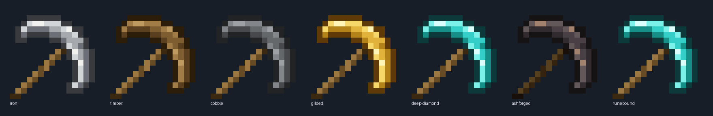
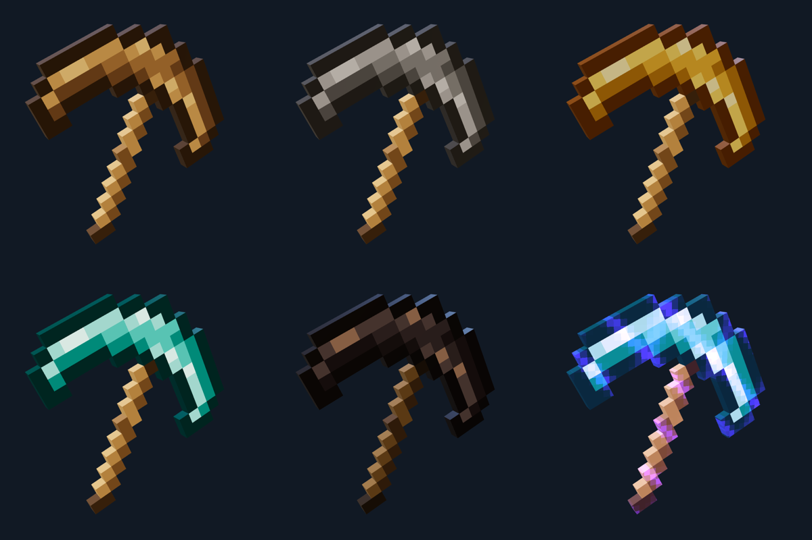

# IRON PICK and the Blockworks tiers

The knife slot (`knife`, index 9, unchanged on the wire and in loadouts) carries the IRON PICK: an original 16x16 item sprite drawn in the blocky-survival inventory style and extruded one pixel thick, the way a held item renders in that genre. No third-party texture pixels are used; the grid in `public/js/guns/models/iron-pickaxe.js` is the source of truth.

## Sprite

- **Silhouette.** A crescent head mirror-symmetric about the handle diagonal (`c + r = 15`): four pixels thick in the arms (outline, two fill rows, outline), both points curling back toward the stick, and a two-pixel diagonal stick from the lower left with a dark butt cap. Shading is lit from the top left: the rear arm has a light top row over a dark underside, the front arm a light inner column over a dark outer one, with a few near-white glints along the top.
- **Roles.** Eight palette roles, each one merged mesh with a flat `kit.mat` colour (eight draws, 604 triangles): `head-outline`, `head-dark`, `head-mid`, `head-light`, `head-highlight`, `handle-outline`, `handle-dark`, `handle-light`. Only faces that border empty sprite space are emitted. Geometry is page-owned and shared by every rig.
- **Placement.** The sprite lies in the gun-local y-z plane, centred at x = 0.01 so it contains both the x = 0 muzzle/sight line and the `HANDS.knife.grip` x of 0.02. It is tilted 25 degrees (`PICKAXE_TILT`): the stick leans 20 degrees forward of vertical, the head arcs over the top, the front point reaches forward and the rear point hangs back. The pixel size (about 0.0378 m) is solved so the forward-most vertex lands exactly on `T.muzzle` z = -0.42 while the stick centre passes through the grip anchor (0.020, -0.225, -0.035). `sightHeight` stays 0.02 (`SIGHT_HEIGHT.knife`), so server hand hitboxes are unchanged.
- **Contract.** `body.userData.proceduralAsset = 'iron-pickaxe'`, `body.userData.pickaxe = { palette: 'iron', roles, pixel, tip, plate }`, groups `pickaxe_head` / `pickaxe_handle`, meshes tagged `userData.pickaxeRole`. The `pickaxe_tip` marker sits on the forward-most vertex. The StatTrak plate seats on the flat two-pixel band of the rear arm (`plate`, tilted with the sprite) and reads from either face.
- **Retired.** The TALON Blender tanto no longer loads (`ASSET_IDS`), which also removes a 334 KB model from the boot library; its source files stay on disk. The melee bundle no longer gets a barrel heat sleeve. The Blender glove uses a knife-specific basis in `kit.js` that turns its wrap axis 47 degrees onto the leaning stick.

| Role | Iron key |
| --- | --- |
| head-outline | `#383a3e` |
| head-dark | `#6c7076` |
| head-mid | `#a6aaaf` |
| head-light | `#d2d5d8` |
| head-highlight | `#f0f1ee` |
| handle-outline | `#3a2811` |
| handle-dark | `#664a23` |
| handle-light | `#9a7641` |

These hex values are stable palette keys: skins match them exactly. None is white or a glove key.

## Tiers

`public/js/cosmetics/skins/pickaxe-tiers.js` is one parametric module. Each tier is a role-to-`{ color, roughness, metalness }` table applied through `SkinLayer.tint` to the two pickaxe groups only, so hands, the StatTrak plate and the flash stub are never recoloured. A tier without a handle table keeps the iron stick.

| Id | Name | Level | Parent | Extra | Look |
| --- | --- | ---: | --- | --- | --- |
| `pickaxe-timber` | Timber | 3 | Reflex sight | — | Plank-brown head, no metal |
| `pickaxe-cobble` | Cobble | 7 | Timber | — | Cool flat greys, a clear step darker than iron |
| `pickaxe-gilded` | Gilded | 20 | Cobble | — | Polished gold, orange shadows, metalness 0.55 |
| `pickaxe-deep-diamond` | Deep Diamond | 40 | Gilded | — | Cyan facets; faint emissive on light and highlight pixels (`cosmeticGlow`) |
| `pickaxe-ashforged` | Ashforged | 45 | Deep Diamond | 500 knife PvP kills | Near-black alloy, warm bronze glints, charred stick |
| `pickaxe-runebound` | Runebound | 60 | Deep Diamond | 2,500 knife PvP kills | Deep Diamond plus a violet enchantment glint |

The level tiers chain along the weapons branch; both mastery tiers are leaves, as `progression-tree-test` requires. Mastery counts knife-slot kills, including quick melee.

**Runebound glint.** A `runebound_glint` layer group under each pickaxe group holds one overlay mesh per role on *cloned* geometry (the clone gets its own empty `userData`, because three's `copy()` shares the source's `userData` object; so `clear()` frees the clone and the base sprite keeps its page-owned flag). The shared material is an additive `ShaderMaterial` (no depth write, polygon offset) with two crossing diagonal bands quantised to half-pixel steps, so the shimmer reads as pixel light. It is registered in the layer's materials, flagged `cosmeticGlow`, and reads `performance.now()` in `onBeforeRender`, so remote and killcam rigs animate it without a per-frame skin hook.

## Renders

- HUD icon `public/assets/weapons/hud/knife.png`: `node tools/render-hud-icon.mjs --weapon knife` (the flat-colour rasterizer; hands hidden, carry tilt undone for the classic 45-degree item pose, output now sRGB-encoded).
- Inventory previews `public/assets/cosmetics/pickaxe-*.png` (1200x800): the canvas of `/cosmetic-preview.html?id=<id>` captured over the muted headless CDP session. The preview now frames visible geometry only; the hidden Blender glove's forearm had pulled the centre off tall models.
- First-person captures in `docs/design/iron-pick/capture-knife-*.png` come from `weapon-capture.html?weapon=knife&state=<state>`; `model-inspection-views.png` shows the glove on the stick from the left, right, close left and three-quarter views, and `stattrak-plate.png` the kill counter seated on the rear arm. The held pose and swing belong to `pickaxe-swing.js`.

No ImageGen pass was run for this model: the sprite is authored directly as pixel data, and the rendered references above were compared against it.

## Checks

`node tools/cosmetics-runtime-test.mjs` covers every tier: all five head roles repaint, the glove stays untouched, only Runebound adds the eight glint overlays (owned additive material, non-page-owned geometry, time read per draw), Deep Diamond carries the emissive, and standard restores the iron palette with the sprite geometry intact. `cosmetics-assets-test` pins eleven 1200x800 previews; `progression-tree-test` validates the chain and leaves. The viewmodel contract asserts the eight-draw procedural build, no heat sleeve, the tip on the muzzle plane and the stick through the grip anchor.
