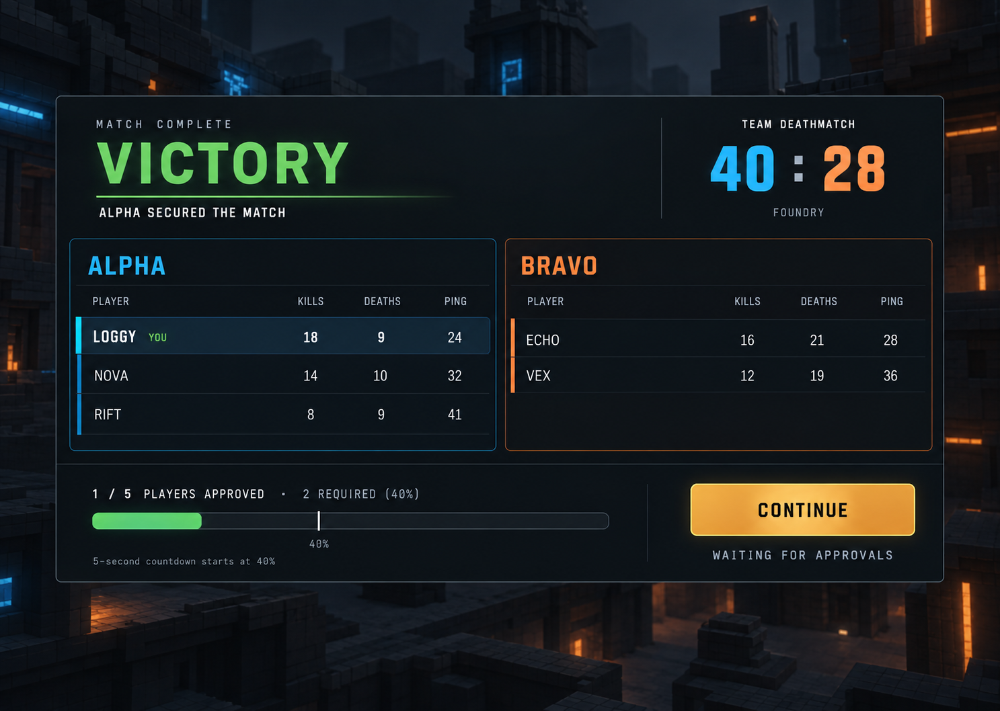
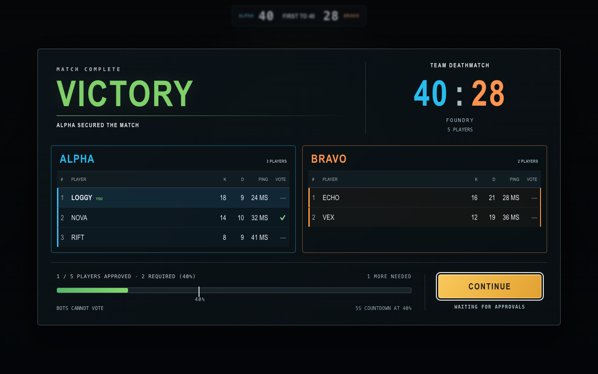
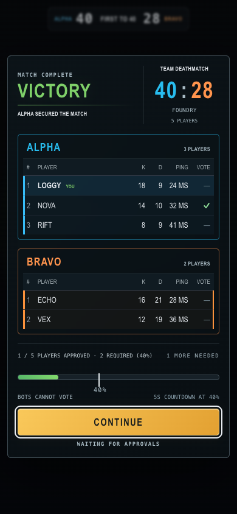
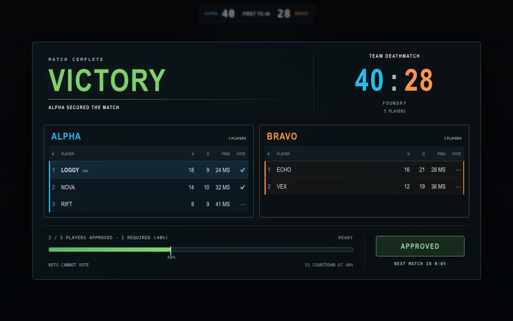

# Round-result design

Three alternatives were generated with the built-in ImageGen tool on
2026-09-12, using the existing round-result screen as the reference. Each
image has its full prompt saved beside it.

| Alternative | Reference | Prompt | Layout |
| --- | --- | --- | --- |
| A, selected | [Wide debrief](a-wide-debrief.png) | [Prompt A](a-wide-debrief.prompt.txt) | Both teams side by side, result header, dedicated approval footer |
| B | [Split summary](b-split-summary.png) | [Prompt B](b-split-summary.prompt.txt) | Result in a left column, stacked teams at right |
| C | [Compact console](c-compact-console.png) | [Prompt C](c-compact-console.prompt.txt) | Centered result with stacked teams and a full-width action |
| D, selected for large matches | [30 humans and 6 bots](d-large-roster-30.png) | [Prompt D](d-large-roster-30.prompt.txt) | 15 humans per team, collapsed bot groups, fixed approval footer |

The [large-match design and implementation](d-large-roster-30.md) extend A
for 30 human players plus 6 bots. Result screens separate bots into collapsible
groups and mark approved humans in a vote column. More than twelve total
participants use compact, independently scrolling rosters with a fixed footer.

A keeps both teams visible together on desktop and gives the approval action
its own area. The implementation uses the existing scoreboard component and
game fonts. At widths up to 700px, team cards stack and the Continue button
uses the full width.

The screenshots below render the actual client components using a fixed
five-player test fixture matching the ImageGen prompts. They are UI test
captures, not evidence of a played match. The generated arena is concept
imagery; gameplay continues to show the actual game world behind the overlay.

## Reference and implementation

## Verification

- `npm run rounds:test`: authoritative approvals, thresholds, joins,
  disconnects, stale votes, retained scores, and the five supported modes.
- `npm run rounds:browser`: visible tables, real button clicks, approvals and
  countdown, five viewport sizes, 64-player overflow, 30 humans plus 6 bots,
  retained scroll and bot groups, and desktop/mobile reference comparison.
- `npm run browser:ui`: HUD rebuild, input and menu lifecycle regressions.

The approval bar uses the server snapshot: one of five players fills 20%,
the threshold marker is at 40%, and two approvals start the five-second
countdown. The persistent project workflow is recorded in `AGENTS.md`.
