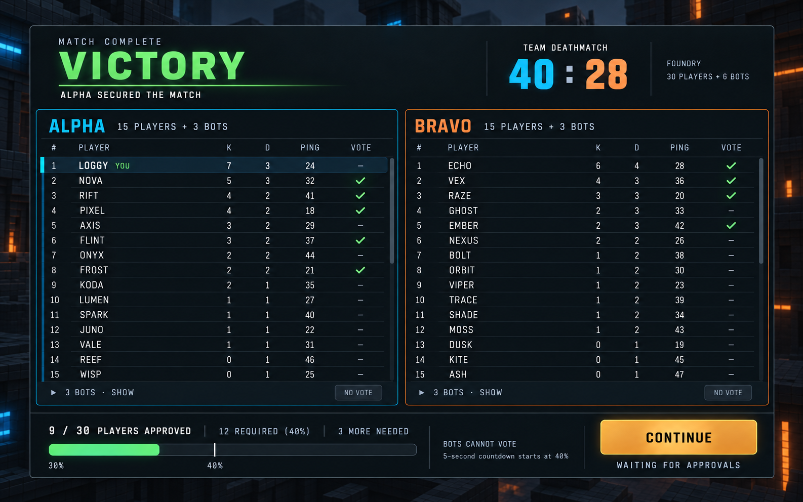
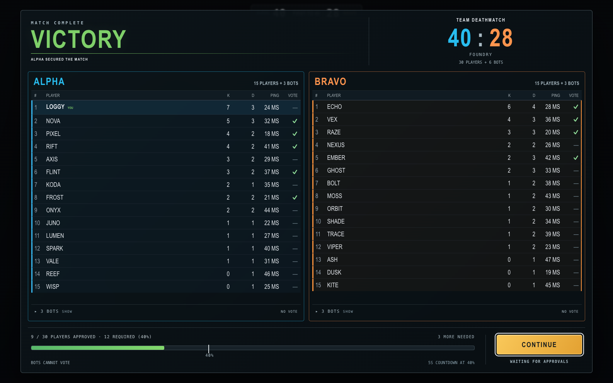
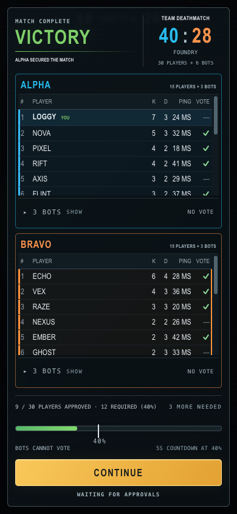
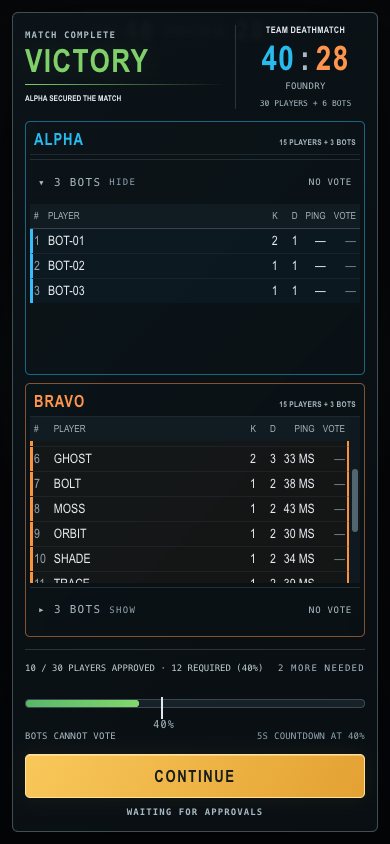
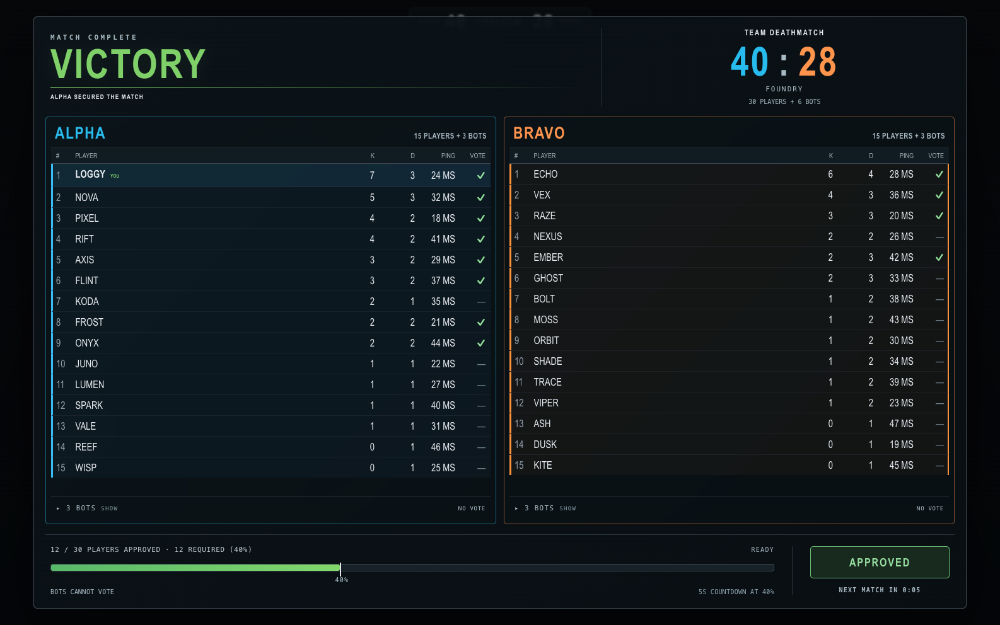

# Large match: 30 humans and 6 bots

Approved ImageGen concept extending the selected wide debrief, implemented
in the existing result overlay and scoreboard components.

- Two team tables, each with 15 human players and a separate group of 3 bots.
- Compact result header and dense readable rows; team and column headings stay visible.
- Table content scrolls for still larger rosters. The approval controls stay
  outside that scroll region.
- Approved humans have a small status check. Bots have a `NO VOTE` label and
  no approval control.
- Bot groups open with mouse, touch or keyboard. On narrow screens, opening
  bots uses that team's roster area; closing the group restores the humans.
- Vote and timer updates preserve expanded groups and scroll positions.
- Large rosters use the available screen height. Desktop shows both teams
  side by side; mobile stacks them above the approval controls.
- The depicted example has 9 approvals out of 30 eligible humans: 30%.
  The threshold is 12 approvals (40%), so 3 more are needed. The countdown
  starts only after the threshold is reached.

The automated server test uses 30 human entities and 6 bot entities: all
bot votes are rejected, nine human votes leave the timer idle, and the
twelfth human vote starts exactly five seconds. Approval eligibility comes
from the server's current human roster; the final scoreboard retains the
round-end results, including participants who subsequently leave.

## Implementation captures

These browser captures use a deterministic UI fixture matching the design,
not a played match. Scores and approval logic are verified separately by
`npm run rounds:test`.

`npm run rounds:browser` covers five viewport sizes (1586 × 992, 1280 × 800,
390 × 844, 844 × 390 and 320 × 568), visible vote status, opening both bot
groups with actual pointer clicks and keyboard input, scroll preservation, pinned headings,
the countdown, new-round reset and S&D's extra status column. The existing
64-player overflow and five-player design checks remain in the same suite.

Generated using the built-in ImageGen tool. [Full prompt](d-large-roster-30.prompt.txt).
The reference is [the wide debrief](a-wide-debrief.png).
