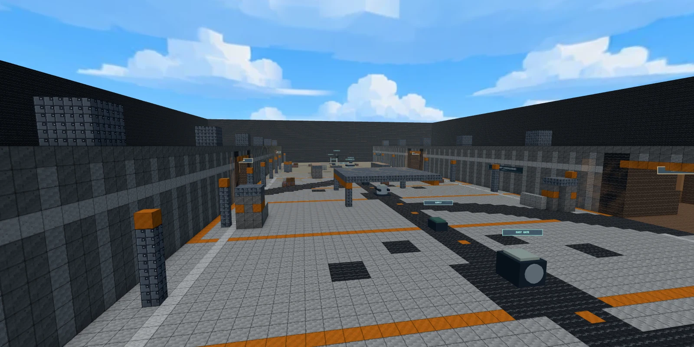

# Bastion: lineare PvE-Verteidigung

Status: lokal implementiert und im Menü auswählbar. Stand: 22. September 2026.
Balancewerte sind Startwerte für Spieltests; eine Zielspieldauer ist noch nicht belegt.

1 bis 4 Spieler verteidigen eine Kette von Zielen gegen endliche, wachsende
Gegnerwellen. Jede Stufe hat ein eigenes Ziel, eine eigene Angriffsrichtung und
eine eigene Bauzone. Ist die letzte Welle einer Stufe geschlagen, zieht sich das
Team zur nächsten Linie zurück. Am Ende hält es einen Extraktionspunkt gegen
endlosen Nachschub, bis das Shuttle eintrifft. Zwischen den Wellen werden
Barrikaden, Wachtürme und Munitionskisten gebaut. Gemeinsame Credits finanzieren
Bauten, Reparaturen und Ausrüstung. Bastion läuft auf **Reactor 9** (`reactor`)
und **Causeway** (`causeway`).

Vorbild sind die Verteidigungsmissionen aus Helldivers 2 („Evacuate High-Value
Assets“): Generatoren hinter Toren, pro Phase eine Angriffsrichtung, Befestigungen
in den Pausen, Gegnerklassen, die innerhalb einer Mission eskalieren, und eine
Extraktion unter Dauerdruck. Die Zuordnung: Stufenziele entsprechen den
Generatoren, gekaufte Barrikaden und Wachtürme den Befestigungs- und
Wachturm-Stratagems (gekauft statt abgerufen), die Gegnerstufen der Größenleiter
(Läufer 0,92 bis Juggernaut 1,4; Walker mit 4,4 m Rumpf), der Rückzug dem
erzwungenen Fallback auf die nächste Linie und die Extraktion dem Pelican-Timer
mit Landeplatte. Bewusste Unterschiede: keine Stratagem-Abrufe, endliche und
lesbare Wellen pro Stufe (`ACTIVE / INBOUND` im HUD), eine Haltestufe endet mit
dem Tod ihrer Wellen, und nur die letzte Stufe läuft auf Zeit.

Spannungskurve: probe (Läufer, Wände unerprobt) → push (erste Sprenger-Rakete)
→ Rückzug → assault (der erste BUGGY rammt eine Wand) → siege (der erste BRUTE
schlägt auf die Linie) → armor (erster APC-Truppenabwurf hinter der Wand) →
Rückzug → onslaught (JUGGERNAUT mit hörbarem Anlauf) → breakthrough (WALKER
zertrampelt Barrikaden, Mörser) → lastStand-Schleife bis zum Shuttle.

## Start und Bedienung

`Create Lobby` → `Bastion · Co-op PvE` → `Reactor 9` oder `Causeway` → `Mark Ready`
→ `Start Match`. Die Lobby bietet vier menschliche Plätze. Gegner werden vom
Wellenmanager erzeugt; der Bot-Regler steht auf null. Über den Raumcode können
weitere Spieler beitreten.

- `B`: Versorgung öffnen. Hauptwaffe und offensiven Wurfgegenstand wählen,
  Team-Upgrades kaufen, eine Befestigung auswählen und sich bereitmelden.
- `N`: Baumodus ein- und weiterschalten (Wand → Sandsäcke → Wachturm → Kiste → aus).
  Im Baumodus dreht `R` die Ausrichtung, die linke Maustaste platziert, `Esc`
  verlässt den Modus. Der Geist zeigt grün, wo gebaut werden darf, und rot mit
  Begründung, wo nicht. Bauen geht nur in Vorbereitung und Versorgung.
- `T` (Interaktion) am beschädigten Ziel halten: vier Sekunden reparieren. Das Menü dafür schließen.
  Das Banner zeigt die Reparatur nur in Reichweite und nennt, wenn die Pausengrenze
  erreicht ist oder das Geld fehlt; dieselbe Prüfung (`bastionRepairStatus`) sperrt die Eingabe.
- Waffenrad: Hauptwaffe, Revolver und Spitzhacke. Eine Rauchgranate ist immer dabei.
- Touch: Armory-, Use- und Build-Chips erscheinen im passenden Spielzustand;
  der Build-Chip schaltet den Bauplan weiter, der Feuer-Chip platziert.
- Gamepad: Es gibt keine freie Taste für den Baumodus. Er wird über die
  Befestigungskarte in der Armory betreten (Steuerkreuz rechts öffnet sie);
  `RT` platziert, `X` dreht, Steuerkreuz rechts oder `Esc` beendet ihn.
- Nach Sieg oder Niederlage startet nach Bestätigung ein frischer Lauf.
  Über das Pausenmenü lässt sich die Partie verlassen.

## Missionsablauf

| Phase | Regel |
| --- | --- |
| `prep` | 25 Sekunden vor der ersten Welle; Bewegung, Käufe, Bauen, Reparatur und Bereitschaft. Kein Feuer. |
| `live` | Die Wellenreihen der aktuellen Stufe; endet erst ohne lebende oder ausstehende Gegner. Kein Kauf, kein Bau. |
| `supply` | 20 Sekunden nach jeder gehaltenen Welle, 30 Sekunden als Rückzug (`transition: 'regroup'`) nach der letzten Welle einer Stufe. Käufe, Bauen und Reparatur. |
| `post` | Ergebnis bis zur Bestätigung der Fortsetzung (Rundenabstimmung), danach fünf Sekunden Countdown und ein frischer Lauf. |

Wenn alle aktiven Spieler bereit sind, endet jede Pause frühestens nach acht
Sekunden. Übergänge entfernen Geschosse, Feuer und Rauch. Gehaltene
Angriffseingaben müssen zum Wellenstart losgelassen werden.

**Stufen.** Jede Karte besteht aus Haltestufen (`hold`) und einer Extraktionsstufe
(`extract`). Eine Haltestufe listet ihre Wellenreihen; nach der letzten Reihe
folgt der Rückzug: Das Ziel der nächsten Stufe wird aktiv, alle Verteidiger werden
zu den Verteidigerpunkten der neuen Stufe versetzt (kein erzwungener Rückmarsch),
das Baubudget beginnt neu, und alte Bauten bleiben stehen, zählen aber nicht mehr.
Das HUD zeigt `STAGE HELD · FALL BACK TO <Name>`.

**Extraktion.** Die letzte Stufe hält 150 Sekunden. Ihre Wellenreihen werden
gespielt, danach läuft die Reihe `lastStand` in Schleife, ohne Belohnung und ohne
Pause. Läuft der Timer ab, gewinnt das Team, sobald das Beacon lebt und
mindestens ein lebender aktiver Verteidiger innerhalb von 8 Metern um das Beacon
steht. Passiert das 30 Sekunden nach Ablauf nicht, ist das Shuttle weg
(`missed`).

Niederlagegründe: `objective` (das aktive Ziel fällt auf 0 HP), `team` (kein
lebender aktiver Verteidiger und keine ausstehende Solo-Rückkehr), `missed`
(Extraktion verpasst), `abandoned` (letzter Spieler verlässt den Lauf).
Zielverlust hat Vorrang vor Teamverlust, beides vor einem gleichzeitigen
Wellenende. Sieg heißt `extracted`.

## Karten

Koordinaten sind Voxel; der Boden liegt auf `GROUND = 14`. Ziele stehen auf
unzerstörbaren 7×7-Sockeln. Spawns, Verteidigerpunkte, Versorgungspunkte und
Fahrzeugrouten sind mit Bedrock unterlegt, die Routen sind ±2 Meter breit bis
vier Blöcke hoch freigeräumt. Die Bauzone jeder Stufe ist am Boden mit einem
Akzentrahmen markiert. Orange Energiefelder sperren die Gegnerzugänge für
Verteidiger; das aktive Ziel hat eine unsichtbare Kollisionssäule.

### Reactor 9

Die industrielle Hofkarte (128 × 96) hat einen zentralen Kernring, die nördliche
Turbinenhalle, die westliche Ladezone und den östlichen Kühlungszugang. Die
Verteidigung wandert von Nord nach Süd.

| Stufe | Ziel | HP | Gegnerrichtung | Bauzone | Wellen |
| --- | --- | ---: | --- | --- | --- |
| 1 · NORTH GATE | COOLANT PUMP (64, 41) | 800 | Nord, TURBINE HALL | x 54–74, z 32–45 | probe, push |
| 2 · REACTOR CORE | REACTOR CORE (64, 54) | 1000 | West, WEST LOADING | x 40–60, z 46–64 | assault, siege, armor |
| 3 · SERVICE BAY | EXTRACTION BEACON (64, 78) | 600 | Ost, EAST COOLING | x 56–84, z 62–75 | onslaught, breakthrough, dann lastStand (150 s) |

Sieben geplante Wellen, fünf davon mit Belohnung. Solo bei idealem Spiel etwa
10 bis 11 Minuten.

### Causeway

Ein Betondamm (192 × 144) zwischen zwei Felsmassiven. Gegner drücken von Osten
nach Westen; die Seitendurchbrüche wechseln zwischen Nord- und Südkammern, dazu
führt eine Fahrzeugstraße über den Damm.

| Stufe | Ziel | HP | Gegnerrichtung | Bauzone | Wellen |
| --- | --- | ---: | --- | --- | --- |
| 1 · EAST GATE | GATE GENERATOR (146, 72) | 800 | Ost, EAST GATE | x 149–163 | probe, push |
| 2 · PUMP HOUSE | MAIN PUMP (112, 72) | 900 | Nord, NORTH BREACH | x 115–133 | assault, siege |
| 3 · SLUICE YARD | SLUICE CONTROL (76, 72) | 1000 | Süd, SOUTH BREACH | x 80–101 | armor, onslaught |
| 4 · CONTROL TOWER | UPLINK TOWER (42, 72) | 1000 | Nord, NORTH BREACH B | x 46–63 | breakthrough |
| 5 · EXTRACTION PAD | EXTRACTION BEACON (16, 72) | 600 | Süd, SOUTH BREACH B | x 22–37 | lastStand (150 s) |

Alle Bauzonen reichen von z 44 bis z 99. Acht geplante Wellen, sieben davon mit
Belohnung. Solo etwa 14 Minuten.

## Gegner

| Rolle | Waffe | HP | Panzerung | Größe (Fahrzeuge: Tempo) | Zielschaden | Durchbruch |
| --- | --- | ---: | ---: | ---: | ---: | --- |
| RUNNER (Läufer) | SMG, Dreiersalve | 80 | 0 | 0,92 | 10 (Nahkampf am Ziel) | 60 alle 0,5 s |
| BREACHER (Sprenger) | Rakete nach 1,8 s Anlauf | 120 | 0 | 1,0 | 80 | Rakete sprengt die Barrikade |
| HEAVY (Schwerer) | LMG, 8er-Salven | 220 | 100 | 1,15 | 5 pro Treffer | 120 alle 0,7 s |
| BRUTE | Schrotflinte auf 4–10 m | 420 | 150 | 1,3 | 25 pro Schlag | 160 alle 0,6 s |
| JUGGERNAUT | LMG, 20er-Salven nach 0,9 s Anlauf | 900 | 300 | 1,4 | 6 pro Treffer | 240 alle 0,8 s |
| BUGGY | SMG-Salven vom Dach | 600 | – | 7,5 m/s | 4 (Rammen) | Rammen 150 |
| APC | Zwei Raketen nach 1,5 s Anlauf | 1800 | – | 3,2 m/s | 60 pro Rakete | Rammen 320 |
| WALKER | LMG, 30er-Salven, Mörser | 3200 | – | 2,0 m/s | 12 pro Treffer | Rammen 400 |

Infanterie skaliert Körper, Trefferzonen und Augenhöhe mit `scale` (auf dem
Draht `npcScale`); der Bewegungskollider bleibt 0,64 × 1,9 m. Größe und HP
steigen in dieser Reihenfolge streng an. Gegner brauchen mindestens 0,6 Sekunden
zur Zielerfassung, drehen begrenzt schnell und verwenden normale Sicht-, Treffer-,
Rüstungs- und Nachladeregeln; NPC-Kopftreffer haben keinen Bonus. Sichtbare
Verteidiger haben Vorrang, dann Bauten in 20 Metern (Türme unter 12 Metern
gehen bei HEAVY und JUGGERNAUT sogar vor Verteidiger), dann die Durchbruchstelle,
dann das sichtbare Ziel in 26 Metern. Rauch und Wände unterbrechen Verfolgung und
Raketen-Anlauf. Der BRUTE schlägt in 2,6 Metern zu: 40 Schaden und Rückstoß auf
Verteidiger, Zielschaden auf Bauten. Der JUGGERNAUT lässt sich nicht
unterdrücken, kündigt jede Salve mit einem Anlauf an und nimmt von hinten das
1,6-Fache.

**Fahrzeuge** folgen der Fahrzeugroute ihrer Stufe, halten im Standabstand vor
dem Ziel und schießen von dort. Sie sind NPC-Einträge mit einem großen
Trefferkasten (`npcVehicle`), Rumpfdrehung zählt für Treffer nicht. Zerstörbare
Blöcke und Bauten im Weg werden gerammt (alle 250 ms ein Viertel des
Rammschadens; ein Barrikadenblock mit 480 HP fällt so nach rund 3 s beim BUGGY,
1,25 s beim APC und 1 s beim WALKER), Bedrock und Metall werden umfahren; nach
drei Sekunden Stillstand parkt das Fahrzeug und kämpft von dort. Verteidiger im
Rumpf nehmen Rammschaden und Rückstoß. Der BUGGY rammt zusätzlich das Zielobjekt. Der APC setzt beim
ersten Halt, unter halber Lebensenergie oder beim Tod vier Läufer ab (was das
Limit nicht zulässt, wird vorn in die Warteschlange gestellt). Der WALKER feuert
alle 8 Sekunden eine Mörsergranate (60 Schaden, 5 Meter Radius, 2 Sekunden
Zünder) auf die zuletzt gesehene Verteidigerposition.

**Schwachstellen.** Kleinwaffen richten an Fahrzeugen nur einen Bruchteil aus
(BUGGY 0,7, APC 0,35, WALKER 0,5). Raketen, Frag-, Limpet- und Pulsgranaten,
Molotow, Flammenwerfer, Longarc, Lance und Sniper durchschlagen voll. Treffer von
hinten zählen 1,5-fach (BUGGY, APC) beziehungsweise doppelt (WALKER); der APC
zeigt dafür eine rot leuchtende Heckluke, der WALKER einen orangen Kern.

## Wellen

Jede Wellenreihe nennt die Solo-Anzahl je Rolle in Spaltenreihenfolge
RUNNER · BREACHER · HEAVY · BRUTE · JUGGERNAUT · BUGGY · APC · WALKER.

| Reihe | Läufer | Sprenger | Schwere | Brute | Jugg. | Buggy | APC | Walker | Gesamt |
| --- | ---: | ---: | ---: | ---: | ---: | ---: | ---: | ---: | ---: |
| probe | 8 | 0 | 0 | 0 | 0 | 0 | 0 | 0 | 8 |
| push | 10 | 1 | 0 | 0 | 0 | 0 | 0 | 0 | 11 |
| assault | 10 | 2 | 1 | 0 | 0 | 1 | 0 | 0 | 14 |
| siege | 10 | 2 | 1 | 1 | 0 | 1 | 0 | 0 | 15 |
| armor | 12 | 2 | 2 | 1 | 0 | 1 | 1 | 0 | 19 |
| onslaught | 12 | 3 | 2 | 2 | 1 | 1 | 1 | 0 | 22 |
| breakthrough | 12 | 3 | 2 | 2 | 1 | 2 | 1 | 1 | 24 |
| lastStand | 14 | 4 | 3 | 3 | 2 | 2 | 2 | 1 | 31 |

Für zwei, drei und vier Spieler wird Infanterie mit 1,6, 2,1 beziehungsweise
2,6 multipliziert und gerundet, Fahrzeuge mit 1, 2 und 2. Beispiel:
`siege` mit vier Spielern ergibt 26 · 5 · 3 · 3 · 0 · 2 · 0 · 0, `lastStand` mit
vier Spielern 77 Gegner. Die Läufer eines APC-Abwurfs zählen zur Welle.

Gleichzeitig leben höchstens 6, 9, 10 beziehungsweise 10 Gegner (Fahrzeuge
eingeschlossen), davon höchstens 1, 1, 2, 2 Fahrzeuge; pro Spezialrolle gilt
zusätzlich `ceil(Spieler / 2)`. Volle Limits verzögern den Nachschub. Gruppen
umfassen maximal drei Gegner im Abstand von drei Sekunden, mit fünf Sekunden
Vorwarnung zum Wellenstart (drei in der Extraktionsschleife). Fahrzeuge
erscheinen allein am Anfang der Fahrzeugroute, frühestens alle neun Sekunden, in
Haltestufen nach der Infanterie und in `lastStand` nach dem ersten Drittel. Die
Teamgröße wird beim Wellenstart festgehalten.

Stufenpläne: Reactor 9 spielt probe, push · assault, siege, armor · onslaught,
breakthrough, dann lastStand; Causeway probe, push · assault, siege · armor,
onslaught · breakthrough · lastStand.

## Bauen

| Bauwerk | Preis | Trefferpunkte | Wirkung |
| --- | ---: | ---: | --- |
| SANDBAG LINE | 40 | 480 je Block | Drei Sandsackblöcke, ein Block hoch. Kniehohe Deckung; Gegner müssen durchbrechen oder ausweichen. |
| BARRICADE WALL | 90 | 480 je Block | Drei breit, zwei hoch. Fahrzeuge rammen sie. |
| SENTRY TURRET | 350 | 400 | Feuert selbstständig auf den nächsten sichtbaren Gegner in 26 Metern: 12 Schaden, 360 Schuss pro Minute, 240 Schuss. Wird in jeder Pause und von Kisten nachgefüllt. |
| AMMO CRATE | 200 | 250 | Sechs Ladungen: +1 Reservemagazin und +25 HP für einen Verteidiger innerhalb von 2,5 Metern, einmal pro Welle. Füllt Türme in 6 Metern. |

Barrikaden sind normale Weltblöcke (`BARRICADE`, Block-ID 85): Verteidigerfeuer
kratzt sie an, Raketen und Pulsgranaten sprengen sie, Frag-Granaten nicht. Türme
und Kisten sind Zielobjekte ohne Sockelblock; nur Gegner können sie beschädigen,
Türme treffen nur Gegner.

Platzierungsregeln, in dieser Reihenfolge geprüft (Server und Bau-Geist teilen
sich die Funktion `canPlaceStructure`):

1. `kind`: bekannter Bautyp, ganzzahlige Zelle, Ausrichtung 0 bis 3.
2. `phase`: nur in Vorbereitung oder Versorgung.
3. `alive`: der Bauende lebt.
4. `reach`: höchstens 6 Meter Abstand (horizontal) und 3 Meter Höhenunterschied.
5. `zone`: alle Zellen in der Bauzone der aktuellen Stufe, in den Kartengrenzen und auf Bodenhöhe.
6. `ingress`: keine Zelle in einem Gegnerzugang oder einem festen Kartenvolumen.
7. `objective`: mindestens 2 Meter Rand um das aktuelle Ziel.
8. `spawn`: mindestens 1,5 Meter Abstand zu Verteidiger- und Versorgungspunkten.
9. `air`: alle Zellen sind Luft.
10. `floor`: unter der untersten Reihe liegt fester Boden.
11. `occupied`: niemand steht in der Zelle (nur der Server prüft das).
12. `structure`: keine Überlappung mit einem bestehenden Bauwerk.
13. `budget`: das Stufenbudget reicht.
14. `credits`: das Geld reicht.

Das Budget pro Stufe beträgt 48 Barrikadenvoxel (acht Wände oder sechzehn
Sandsacklinien), zwei Türme und eine Kiste. Zerstörte Bauten geben ihr Budget
frei; Bauten früherer Stufen bleiben stehen und zählen nicht mehr. Ein frischer
Lauf stellt Welt, Blockschäden und Bauten zurück.

**Durchbruch-KI.** Die Navigation kennt zwei Felder: eines behandelt Bauten als
Wände, das andere lässt sie mit sechsfachen Kosten passieren. Findet ein Gegner
keinen freien Weg oder steckt er vier Sekunden ohne Ziel fest, wählt er den
günstigsten Durchbruch, läuft davor und schlägt mit seinem Durchbruchwert auf den
Block oder das Bauwerk ein (`npcAttack: 'breach'`); Sprenger schießen stattdessen
ihre Rakete auf die Zelle. Weil jede Spawnkammer über Bedrock mit ihrem Ziel
verbunden ist, gibt es keine abgeriegelte Zone. Fahrzeuge rammen alles
Zerstörbare in ihrer Spur. Ein Durchbruch löst `bastion_breach` (höchstens alle
drei Sekunden) und das Banner `BREACH AT THE LINE` aus.

## Versorgung und Teamkasse

Start und Versorgung geben 100 Spieler-HP, geladene Waffen, drei Reservemagazine
je Schusswaffe, einen Rauch und einen gewählten offensiven Wurfgegenstand. Die
Hauptwaffenwahl kostet nichts und addiert keine Munition bei wiederholter Auswahl.
Rüstung startet bei 50; Überlebende behalten später ihren Rest, Rückkehrer starten bei null.

Das Team beginnt mit 400 Credits. Jede gehaltene Welle `w` (globale Zählung)
gibt `300 + 50 × w`; jede abgeschlossene Haltestufe zusätzlich 250. Die
Extraktionsschleife zahlt nichts. Ohne Ausgaben stehen am Ende 3.150 Credits auf
Reactor 9 und 4.900 auf Causeway zur Verfügung.

| Angebot | Preis | Wirkung |
| --- | ---: | --- |
| Reparatur am Ziel | 150 | Bis zu 200 HP; vier Sekunden innerhalb von drei Metern, höchstens zweimal pro Pause. |
| Team Armor | 200 | +50 Rüstung für alle aktiven Verteidiger, maximal 100; einmal pro Pause. |
| Ammo Reserve | 400 | Ein zusätzliches Reservemagazin je Schusswaffe bei jeder Versorgung; einmal pro Lauf. |
| Fast Reload | 600 | 15 % kürzere Nachladezeiten, auch für einzelne Patronen; einmal pro Lauf. |
| Sandsäcke / Wand / Turm / Kiste | 40 / 90 / 350 / 200 | Siehe Bauen. |

Eine Reparatur reserviert Geld bis zum Abschluss. Loslassen, Weggehen, Verlassen
oder Phasenwechsel gibt die Reservierung frei. Käufe prüfen Lauf, Pausenzähler,
Request-ID, verfügbares Geld, Kaufgrenzen und Platzierungsregeln auf dem Server.
Doppelte oder veraltete Requests haben keinen weiteren Effekt. Der Snapshot
bestätigt Guthaben, Kaufstände, Bauten und Budget.

Nach der Hälfte aller erledigten Gegner öffnet der Versorgungspunkt der Stufe.
Jeder Spieler erhält dort einmal pro Welle bis zu 35 HP und ein Reservemagazin für
seine Hauptwaffe. Munitionskisten geben während Welle und Pause einmal pro Welle
und Spieler +25 HP und ein Magazin; in der Extraktionsschleife zählt jede
neue Reihe als Welle, und Kisten füllen dann auch Türme in 6 Metern nach. Bastion verwendet keine zufälligen
Arena-Power-ups.

Vorgesehene Solo-Ausgabenkurve auf Reactor 9: Vorbereitung 400 → Wand, Sandsäcke
und Rüstung (330); nach probe (+350) → Turm; nach push (+400, +250) → Kiste und
Wand; Stufe 2 (+450, +500, +550, +250) → Ammo Reserve, zweiter Turm, Wände;
Extraktion → Fast Reload oder Reparaturen.

## Tod und Beitritt

Gefallene Koop-Spieler beobachten ihr Team bis zur nächsten Pause. Ein allein
gestarteter Lauf erlaubt genau eine Notfall-Rückkehr nach fünf Sekunden mit 100 HP,
null Rüstung und Grundausrüstung. Das Ziel bleibt dabei verwundbar. Mit einem
zweiten aktiven Verteidiger verfällt eine ungenutzte Solo-Rückkehr dauerhaft.

Beitritt und Reconnect während einer Welle führen bis zur nächsten Pause in die
Zuschauerrolle und vergeben kein zusätzliches Leben. Während Vorbereitung,
Versorgung und Rückzug ist direkter Einstieg möglich. Der letzte
Verbindungsabbruch beendet den Lauf als verlassen. NPCs belegen keine
Lobbyplätze und werden bei einem Beitritt nicht übernommen.

Die Extraktion verlangt nach Ablauf des Timers mindestens einen lebenden aktiven
Verteidiger innerhalb von 8 Metern um das Beacon. Tote Spieler zählen nicht; in
der Extraktionsstufe gibt es keine Pause mehr, in der sie zurückkehren könnten.

## Implementierung und Prüfung

- `shared/bastion.js`: Regeln, Rollen, Gegnerprofile, Wellenreihen und
  Skalierung, Durchschlagsliste, Kaufgrammatik.
- `shared/bastion-build.js`: Baukatalog, Fußabdruck und `canPlaceStructure`.
- `shared/world/bastion-layouts.js`: Registry `BASTION_LAYOUTS`,
  `bastionDefenderSolid`, Wellen- und Stufenhelfer; `reactor-layout.js` und
  `causeway-layout.js` beschreiben die Stufen; `flatmap-reactor.js` und
  `flatmap-causeway.js` erzeugen die Karten samt Schutzdurchlauf.
- `server/modes/bastion.js`: Ablauf, Stufen, Ziel, Kasse und Extraktion;
  `bastion/enemies.js`, `navigation.js`, `vehicles.js`, `structures.js`: Infanterie
  und Durchbruch, Doppelfeld-Navigation, Fahrzeugfahrer, Bauten und Türme.
- Client: `engine/bastion-world.js` und `bastion-structures.js` (Ziele,
  Zugänge, Bauzone, Bauten), `avatar/bastion-avatar.js` und `bastion-vehicle.js`
  (Gegnersilhouetten und Fahrzeuge), `player/build-controller.js` (Baumodus und
  Geist), `ui/bastion-hud.js` und `bastion-armory.js`.

Protokoll: NPC-Zeilen tragen `npcRole`, `npcAttack`, bei Bedarf `npcScale` und
`npcVehicle`. `match.bastion` liefert `stage` (Index, Anzahl, Name, Art, Welle,
Übergang, Extraktionsende, Bauzone, nächste Stufe), `core` als Alias des aktiven
Ziels, `held`, `structures`, `budget`, `vehicles`, `lanes` und `supply`. Käufe
laufen über den bestehenden Buy-Frame mit
`bastion:<run>:<prep>:<request>:<action>[:item][:<x>:<y>:<z>:<facing>]`; Bauten
nutzen `build:<kind>:<x>:<y>:<z>:<facing>`. Ereignisse: `bastion_stage`,
`bastion_regroup`, `bastion_extract`, `bastion_build`, `bastion_structure`,
`bastion_breach`, `bastion_vehicle`, `bastion_tier` neben den bisherigen.

`npm run bastion:test` deckt beide Karten: Wellentabelle und Registry, Käufe und
Baugrammatik, Bauregeln mit Budget und Rückbau, Durchbruch-KI, Wachturm,
Fahrzeuge (Fahren, Rammen, Kleinwaffenfaktor, APC-Raketen und Abwurf),
Zielschaden je Profil, komplette Läufe bis zur Extraktion mit exakter Kasse,
verpasste Extraktion und Beacon-Verlust, Stufenwechsel, Erreichbarkeit jeder
Stufe, skalierte Trefferzonen, Layout-Verträge (Zugänge, Routen, Türbreite)
und die Client-Konstruktion. Der WebSocket-Test prüft Lobby, Kauf, späten
Beitritt, vier Plätze, getrennte NPC-Snapshots und einen Sandsackbau auf Causeway.
`tools/bastion-ui-test.mjs` prüft ohne Browser HUD-Beschriftungen und
Reparaturhinweis, Baubudgets, das gemeinsame Kauffenster (`buyWindowOpen`) und die
Tab-Reihenfolge der Versorgung nach Wechseln zwischen den Shop-Modi.
Die Suite ist in `npm test` enthalten.

Balance-Spieltests stehen aus: Ein vollständiger Durchlauf durch menschliche
Spieler und eine Messung von Schwierigkeit, Spieldauer und Belastung auf
Referenzhardware fehlen. Eine Browserprüfung ist auf dieser Maschine nicht
vorgesehen (die Spielaudio-Ausgabe läuft dort ungedämpft); die Node-Suiten und
die stummen CDP-Aufnahmen ersetzen sie.
