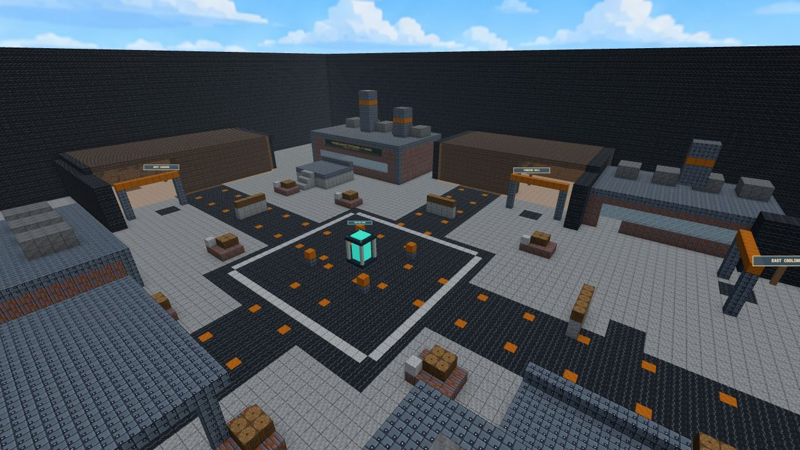

# Bastion: PvE auf Reactor 9

Status: lokal implementiert und im Menü auswählbar. Stand: 9. September 2026.
Balancewerte sind Startwerte für Spieltests; eine Zielspieldauer ist noch nicht belegt.

1 bis 4 Spieler verteidigen einen Energiekern gegen acht endliche Gegnerwellen.
Bastion nutzt die eigene Karte **Reactor 9** (`reactor`). Zerstörte Deckung bleibt
bis zum nächsten Lauf zerstört. Gemeinsame Credits finanzieren Reparatur und Ausrüstung.

## Start und Bedienung

`Create Lobby` → `Bastion · Co-op PvE` → `Reactor 9` → `Mark Ready` → `Start Match`.
Die Lobby bietet vier menschliche Plätze. Gegner werden vom Wellenmanager erzeugt;
der Bot-Regler steht auf null. Über den Raumcode können weitere Spieler beitreten.

- `B`: Versorgung öffnen, Hauptwaffe und offensiven Wurfgegenstand wählen,
  Team-Upgrades kaufen und für die nächste Welle bereitmelden.
- `E` am beschädigten Kern halten: vier Sekunden reparieren. Das Menü dafür schließen.
- Waffenrad: Hauptwaffe, Revolver und Spitzhacke. Eine Rauchgranate ist immer dabei.
- Touch: Armory- und Use-Schaltflächen werden im passenden Spielzustand angeboten.
- Nach Sieg oder Niederlage startet nach 15 Sekunden ein frischer Lauf.
  Über das Pausenmenü lässt sich die Partie verlassen.

## Reactor 9

Die eigene industrielle Hofkarte hat einen zentralen Kernring, die nördliche
Turbinenhalle, die westliche Ladezone und den östlichen Kühlungszugang. Deckungen,
Servicegebäude und erhöhte Stege bieten verschiedene Schusspositionen. Die Service Bay
liegt südlich des Kerns und versorgt Spieler während der Welle.

NPCs erscheinen in gedeckten Kammern hinter abgewinkelten Ausgängen. Orange
Energiefelder sperren diese Bereiche für Verteidiger. Kammerwände und -dächer,
tragender Unterboden und zentrale Laufstreifen sind unzerstörbar. Deckungen und
Gebäude im Kampfbereich lassen sich mit den normalen Waffen zerstören.

Die Navigation berechnet nach Weltzerstörung die Wege zum Kern neu. Gegner bewegen
sich mit der normalen Spielerkollision über den Hof. Ein neuer Lauf stellt Welt
und Blockschäden wieder her; eine Kernreparatur ersetzt keine zerstörte Deckung.

## Ablauf

| Phase | Regel |
| --- | --- |
| Vorbereitung | 25 Sekunden vor Welle 1; Bewegung, Ausrüstung, Käufe und Bereitschaft. |
| Angriff | Angekündigter, endlicher Nachschub. Ende erst ohne lebende oder ausstehende Gegner. |
| Versorgung | 20 Sekunden nach Welle 1 bis 7; Belohnung, Rückkehr, Munition und Reparaturen. |
| Ergebnis | Sieg nach Welle 8; Niederlage bei Kernverlust oder ausgeschaltetem Team. |

Wenn alle aktiven Spieler bereit sind, endet die Vorbereitung frühestens nach acht
Sekunden. Außerhalb des Angriffs sind Schaden, Feuer und Würfe gesperrt. Übergänge
entfernen Geschosse, Feuer und Rauch. Gehaltene Angriffseingaben müssen zum Wellenstart
losgelassen werden. Kern- und Teamverlust haben Vorrang vor einem gleichzeitigen Wellenende.

Der Kern hat 1.000 HP. Spieler können weder ihm noch Mitspielern Schaden zufügen;
eigene Explosionen und Umweltschaden bleiben gefährlich. NPCs beschädigen einander
nicht. Bei 500 und 250 HP wechseln Kernleuchten und HUD-Farbe, begleitet von einem Alarm.

## Gegner und Wellen

| Rolle | Werte | Angriff |
| --- | --- | --- |
| Läufer | 80 HP, 1,1-faches Lauftempo | SMG-Dreiersalve, 6 Schaden pro Treffer, 1 Sekunde Pause. Am Kern 10 Nahkampfschaden pro Sekunde innerhalb von 2,5 Metern. |
| Sprenger | 120 HP, 0,8-faches Lauftempo | Rakete nach 1,8 Sekunden hörbarer und sichtbarer Vorbereitung; danach 6 Sekunden Pause. Bis zu 70 Spielerschaden oder 80 Kernschaden. |
| Schwerer | 220 HP plus 100 Rüstung, 0,65-faches Lauftempo | LMG mit maximal acht Schüssen in 2 Sekunden, 8 Spielerschaden oder höchstens 5 Kernschaden pro Treffer; 3 Sekunden Pause. |

Gegner brauchen mindestens 0,6 Sekunden zur Zielerfassung, drehen begrenzt schnell
und verwenden normale Sicht-, Treffer-, Rüstungs- und Nachladeregeln. NPC-Kopftreffer
haben keinen Schadensbonus. Sichtbare Verteidiger haben Vorrang. Ohne Spielersicht
rücken Läufer zum Kern vor; Sprenger greifen markierte Deckung oder den sichtbaren
Kern an, Schwere den sichtbaren Kern. Rauch und Wände unterbrechen die Zielverfolgung
und laufende Raketen-Vorbereitung. Bereits fliegende Raketen bleiben gefährlich.

| Welle | Läufer | Sprenger | Schwere |
| --- | ---: | ---: | ---: |
| 1 | 8 | 0 | 0 |
| 2 | 10 | 1 | 0 |
| 3 | 12 | 2 | 0 |
| 4 | 12 | 2 | 1 |
| 5 | 14 | 3 | 1 |
| 6 | 16 | 3 | 2 |
| 7 | 18 | 4 | 2 |
| 8 | 20 | 4 | 3 |

Die Tabelle gilt solo. Für zwei, drei und vier Spieler wird jeder Gegnertyp mit
1,6, 2,1 beziehungsweise 2,6 multipliziert und gerundet. Es leben höchstens fünf
Gegner solo und acht im Koop gleichzeitig. Pro Spezialrolle gilt zusätzlich
`ceil(Spieler / 2)`. Volle Limits verzögern den Nachschub.

Gruppen umfassen maximal drei Gegner im Abstand von mindestens drei Sekunden.
Neue Zugänge haben fünf Sekunden Vorwarnung. Wellen 1 und 2 nutzen einen Zugang;
ab Welle 3 wechseln die Richtungen. Bis Welle 4 sind höchstens zwei Zugänge
zugleich aktiv, danach bis zu drei. Solo bleibt es bei einem, mit drei Spielern
bei höchstens zwei. Die Teamgröße wird beim Wellenstart festgehalten.

## Versorgung und Teamkasse

Start und Versorgung geben 100 Spieler-HP, geladene Waffen, drei Reservemagazine
je Schusswaffe, einen Rauch und einen gewählten offensiven Wurfgegenstand. Waffen
mit einzelnen Patronen erhalten die entsprechende Anzahl voller Magazinladungen.
Die Hauptwaffenwahl kostet nichts und addiert keine Munition bei wiederholter Auswahl.
Rüstung startet bei 50; Überlebende behalten später ihren Rest, Rückkehrer starten bei null.

Das Team beginnt mit 400 Credits. Welle `w` gibt `300 + 50 × w`; nach Welle 8 folgt
direkt das Ergebnis. Vor dem Finale sind ohne Ausgaben insgesamt 3.900 Credits verfügbar.

| Angebot | Preis | Wirkung |
| --- | ---: | --- |
| Reparatur am Kern | 150 | Bis zu 200 HP; vier Sekunden innerhalb von drei Metern, höchstens zweimal pro Pause. |
| Team Armor | 200 | +50 Rüstung für alle aktiven Verteidiger, maximal 100; einmal pro Pause. |
| Ammo Reserve | 400 | Ein zusätzliches Reservemagazin je Schusswaffe bei jeder Versorgung; einmal pro Lauf. |
| Fast Reload | 600 | 15 % kürzere Nachladezeiten, auch für einzelne Patronen; einmal pro Lauf. |

Eine Reparatur reserviert Geld bis zum Abschluss. Loslassen, Weggehen, Verlassen
oder Phasenwechsel gibt die Reservierung frei. Käufe prüfen Lauf, Vorbereitungsphase,
Request-ID, verfügbares Geld und Kaufgrenzen auf dem Server. Doppelte oder veraltete
Requests haben keinen weiteren Effekt. Der Snapshot bestätigt Guthaben und Kaufstände.

Nach der Hälfte aller erledigten Gegner öffnet die Service Bay. Jeder Spieler erhält
dort einmal pro Welle bis zu 35 HP und ein Reservemagazin für seine Hauptwaffe.
Bastion verwendet keine zufälligen Arena-Power-ups.

## Tod und Beitritt

Gefallene Koop-Spieler beobachten ihr Team bis zur nächsten Versorgung. Ein allein
gestarteter Lauf erlaubt genau eine Notfall-Rückkehr nach fünf Sekunden mit 100 HP,
null Rüstung und Grundausrüstung. Der Kern bleibt dabei verwundbar. Mit einem zweiten
aktiven Verteidiger verfällt eine ungenutzte Solo-Rückkehr dauerhaft.

Beitritt und Reconnect während einer Welle führen bis zur Versorgung in die
Zuschauerrolle und vergeben kein zusätzliches Leben. Während der Vorbereitung ist
direkter Einstieg möglich. Der letzte Verbindungsabbruch beendet den Lauf als verlassen.
NPCs belegen keine Lobbyplätze und werden bei einem Beitritt nicht übernommen.

## Implementierung und Prüfung

- `shared/bastion.js`: Wellentabelle, Balance, Kaufprotokoll und Waffenanpassungen.
- `shared/world/flatmap-reactor.js` und `reactor-layout.js`: eigene Karte und Metadaten.
- `server/modes/bastion.js` und `bastion/`: Ablauf, Kern, Kasse, NPCs und Navigation.
- `public/js/ui/bastion-*`, `engine/bastion-world.js`, `avatar/bastion-avatar.js`:
  Versorgung, HUD, Kern, Zugangsmarkierungen und sichtbare Gegnerrollen.

`npm run bastion:test` prüft alle acht Wellen bis zum Sieg mit einem deterministischen
Testschützen, Niederlagen, Solo-Rückkehr, Reservierungen, Käufe, Spawns, Navigation,
Rauchabbruch, echte Treffer und Raketenflug. Ein separater Test mit echten WebSockets
prüft Lobby, Kauf, späten Beitritt, vier Plätze und getrennte NPC-Snapshots. Die Suite
ist in `npm test` enthalten. Browserprüfung umfasst Lobby, Waffenwahl, Teamkauf,
Bereitschaft, HUD und das scrollbare Versorgungspanel bei 392 Pixel Breite.

Ein vollständiger Durchlauf durch menschliche Spieler und eine Messung von
Schwierigkeit, Spieldauer und Belastung auf Referenzhardware stehen noch aus.
